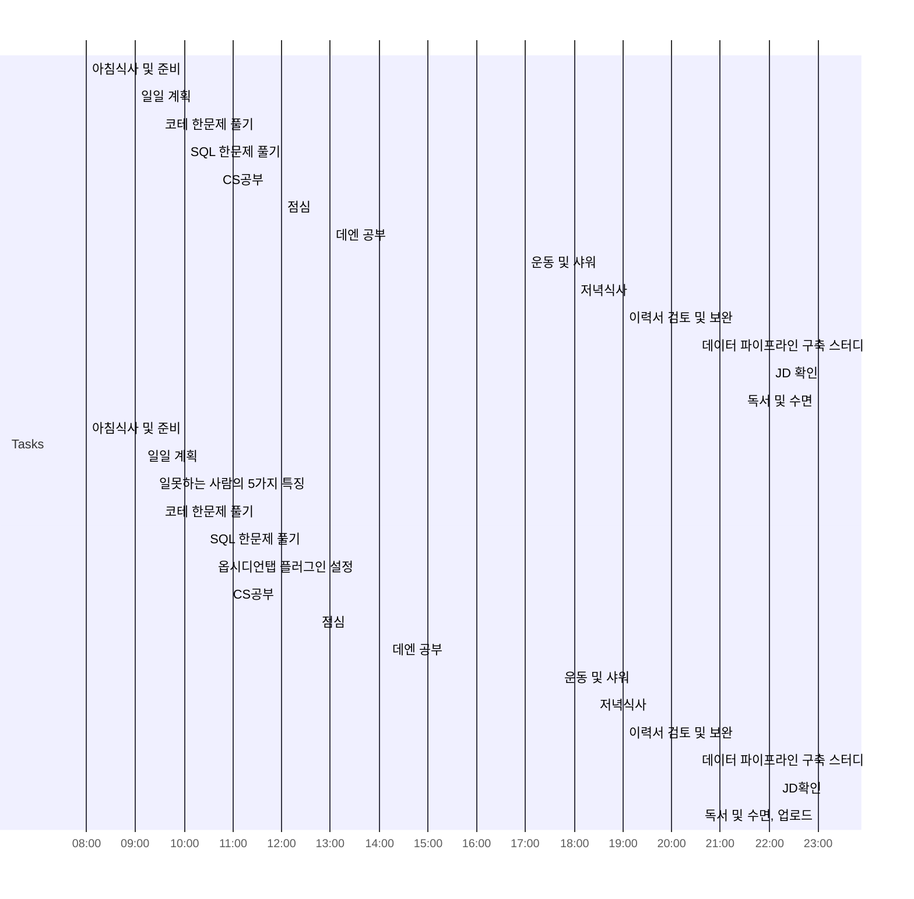

## Day Planner

## TODO
- 이력서 검토 및 보완
  - 과거 내용 복습
- sql, 코테 하루 한문제
- 운동
- JD 검토 
- 데엔 공부
- 하루 50 페이지 책 읽기
- CS공부

## PLAN
- [x] 08:00 아침식사 및 준비
- [x] 09:00 일일 계획
- [x] 09:30 코테 한문제 풀기
- [x] 10:00 SQL 한문제 풀기
- [x] 10:40 CS공부
- [x] 12:00 점심
- [x] 13:00 데엔 공부
- [x] 17:00 운동 및 샤워
- [x] 18:00 저녁식사
- [x] 19:00 이력서 검토 및 보완
- [x] 20:30 데이터 파이프라인 구축 스터디
- [ ] 22:00 JD 확인
- [ ] 23:00 독서 및 수면

## REAL WORK
- [x] 08:00 아침식사 및 준비
- [x] 09:08 일일 계획
- [x] 09:23 일못하는 사람의 5가지 특징
      [링크](https://www.youtube.com/watch?v=Bfr4ZSlQVWw)
      1. 피드백을 수용하지 않음
      2. 주변에 도움을 구하지 않는다.
      3. 우선 순위를 세우지 못한다.
      4. 공부를 안한다.
      5. 조금만 일을 잘해도 인정받고 싶어한다.
- [x] 09:30 코테 한문제 풀기
      30분을 풀기로했으나 풀기 + 기록까지하니까 시간이 꽤나 걸렸다.
- [x] 10:25 SQL 한문제 풀기
- [x] 10:35 옵시디언탭 플러그인 설정
- [x] 10:53 CS공부
- [x] 12:43 점심
	갑자기 친구와 같이 점심을 먹게되어 시간을 조정
- [x] 14:09 데엔 공부
      데이터 엔지니어의 목적 필요성
      스파크 설치 및 환경셋팅
- [x] 17:41 운동 및 샤워
- [x] 18:24 저녁식사
- [x] 19:00 이력서 검토 및 보완
- [x] 20:30 데이터 파이프라인 구축 스터디
- [ ] 22:09 JD확인
- [ ] 23:00 독서 및 수면, 업로드

## MEMO

## Retrospective
데이터 파이프라인 구축 스터디에 들어왔다.  
다음 스터디까지의 과제가 스터디를 통해 무엇을 할지를 정해야한다.  
생각을 더 해봐야겠지만 당장 드는 생각은 내가 주마다 공부한 것과 진행중인것을 발표해봐야겠다.
